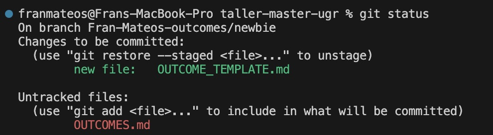

# Exercise Outcomes Submission Template

**Student/Group Name**: [Your name or group identifier, e.g., "Group A"]  
**Level Completed**: [newbie / intermediate / master / master-of-the-universe]  
**Date**: [Submission date]

---

## 📋 Exercise Summary

### Exercise: Part 1: Commands you used (config, clone, add, commit, status, log)
**Status**: ✅ Completed 

**What I did**:
I followed the instructions of the guides exercise. I knew the commands used in this level but I had some interesting issues:
- I started working in main branch, by mistake, and ```git status``` didn't show the file hello.txt. I discovered it was listed in .gitignore.
- I did ```git clone``` the professor repo instead of forking it. I could not push the feature/my-info because it is restricted.

**Commands Used**:
```bash
# List the key Git commands you used across all parts of the exercise
git status
git add .
git add hello.txt
git log
git commit -m "Added hello.txt with my name"

```

**Results/Output**:
```
# Paste relevant command outputs, git log, or status messages
git log
commit 04f1b7c2b7ce0a8797e31d340ad109b64ef34b47 (HEAD -> Fran-Mateos-outcomes/newbie, newbie)
Author: Fran Mateos <francisco.mateos@gmail.com>
Date:   Thu Dec 25 19:23:45 2025 +0000

    Added hello.txt with my name

```

**Screenshots**



### Exercise: Part 2: Commands for creating and switching branches, and remote operations

**Status**: ✅ Completed 

**What I did**:
I followed the instructions of the guides exercise and use git documentation and google AI to read about git commands used in this practice. I haved used the git commands in this exercise before but I learned them better with this exercise.

**Commands Used**:
```bash
# List the key Git commands you used across all parts of the exercise
git status
git checkout -b feature/my-info
git add my-info.txt
git log
git commit -m "Added my-info.txt with personal info"
git push origin feature/my-info
git switch newbie
git pull origin newbie

```

**Results/Output**:
```
# 
$ git commit -m "Added my-info.txt with personal info"
[feature/my-info 6171dd3] Added my-info.txt with personal info
 1 file changed, 3 insertions(+)
 create mode 100644 my-info.txt

$git push origin feature/my-info
Enumerating objects: 7, done.
Counting objects: 100% (7/7), done.
Delta compression using up to 10 threads
Compressing objects: 100% (6/6), done.
Writing objects: 100% (6/6), 713 bytes | 713.00 KiB/s, done.
Total 6 (delta 1), reused 0 (delta 0), pack-reused 0 (from 0)

$git branch -a
* Fran-Mateos-outcomes/newbie
  feature/my-info
  main
  newbie
  remotes/origin/HEAD -> origin/main
  remotes/origin/feature/my-info
  remotes/origin/intermediate
  remotes/origin/main
  remotes/origin/master
  remotes/origin/master-of-the-universe
  remotes/origin/newbie

$git log --oneline --graph --all
* 6171dd3 (origin/feature/my-info, feature/my-info) Added my-info.txt with personal info
* 04f1b7c (HEAD -> Fran-Mateos-outcomes/newbie, newbie) Added hello.txt with my name
* 360f4a4 (origin/newbie) refactor: consolidate newbie exercises into single comprehensive exercise
* 5eedc97 docs: Add submission instructions to newbie level
* 45e1c31 Update README for newbie level exercises
| * 9602351 (origin/main, origin/HEAD, main) Adding GenAI guidelines
| * 7ad3af4 docs: update main branch files to reflect consolidated exercise structure (1 per level)
| * 4d9131e chore: remove instructor files from repository tracking
| *   adbb307 Merge pull request #9 from miguel-oltra/patch-gitignore-update
| |\  
| | * e4709e6 Updated CODEOWNERS file
| | * 2a39a02 chore: add INSTRUCTOR_GUIDE.md to gitignore
| | * 0abdbae chore: add SUMMARY.md to gitignore for instructor files
| |/  
| * 88a54ab chore: Add .gitignore to exclude instructor files and sensitive data
| * e39ff08 PROMPT for updated
| * df1cfdd fix: Update CODEOWNERS to allow trainee work while protecting exercise branches
| * a011fad config: Add CODEOWNERS file for code review requirements
| * 769be64 docs: Add complete implementation summary
| * 9d008fa Updated README.MD with guidelines for the exercises
| * f66bf22 docs: Update MODEL_SPEC.MD with PROMPT 2 requirements
| * c24fd57 docs: Add outcome submission process and evaluation criteria
| * ec488d0 Update main README with complete training overview and navigation
|/  
| * b0fb9dc (origin/master-of-the-universe) refactor: consolidate master-of-the-universe exercises into single comprehensive exercise
| * d1ef79f docs: Add submission instructions to master-of-the-universe level
| * 5bffa64 Update README for master-of-the-universe level exercises
|/  
| * b5d8eb6 (origin/master) refactor: consolidate master exercises into single comprehensive exercise on history rewriting
| * 960a0a6 docs: Add submission instructions to master level
| * f0055a0 Update README for master level exercises
|/  
| * 994450b (origin/intermediate) refactor: consolidate intermediate exercises into single comprehensive exercise
| * a1c17e7 docs: Add submission instructions to intermediate level
| * 9f25f7a Update README for intermediate level exercises
|/  
* dc58203 Revert "Update README.md"
* e2db1ca (tag: v0.0.1) Update README.md
* 3d651c3 Update README.md
* 4cc5635 Initial commit

```

**Screenshots**


---

## 🎯 Key Learnings

**Main concepts I learned**:
1. The difference between git switch and git checkout
2. How to use the git log command and read its output

**Skills I improved**:
- Comprehension of basic git commands (add, commit)
- Reading and interpreting git log output
- Understanding how the staging area works in the git workflow

---
## 🚧 Challenges Faced

### Challenge 1: File not showing in git status and incorrect repository setup
**Problem**: I started working directly on the main branch by mistake, and when I created hello.txt, it didn't appear in `git status`. Additionally, I cloned the professor's repository instead of forking it, which prevented me from pushing my changes due to restricted permissions.

**Solution**: I discovered that hello.txt was listed in .gitignore, which is why git wasn't tracking it. For the repository issue, I learned the importance of forking a repository first when contributing to projects, rather than cloning directly, as this gives you ownership and push permissions to your own copy.

**Comments**
- I didn't experience any problem seting up my ssh keys, I had already done it in the past. The instructions was very clear.
- Regarding stagging vs commiting, I think I know the difference. The former indicates what files I want to keep save and tracked and the former actually saves or takes a photo of the state of these files.
- I had an issue trying to push to the professor repo, it was restricted.
- Three-tree architecture (working dir, staging, repo): The working directory is where you edit files, the staging area is where you prepare changes with git add, and the repository stores the final commits. This separation lets you choose which changes to save together, keeping your project history clean and organized.
- When would you use branches in real projects: Branches are essential for developing multiple features simultaneously without interfering with each other. Teams use them to isolate work—each developer works on their own feature branch, then merges it back to main once complete and reviewed. This prevents breaking the main codebase.
- Difference between local and remote repositories: Your local repository is on your computer and contains the full Git history. A remote repository (like on GitHub) is hosted on a server and acts as a central hub where team members push their changes and pull others' work. git push sends your commits to the remote, and git fetch/git pull brings remote changes to your local copy.

**Commands/Approach**:
```bash
# git status with --ingored flag to list also ignored files
git status --ignored
# Check why a file is being ignored
git check-ignore -v hello.txt

# Create a fork first on GitHub before cloning
git clone https://github.com/your-username/repo-name.git

# Switch to the correct branch
git switch feature/my-info
```

---

## 💭 Personal Reflection

**What surprised me**:
I didn't know the git log command before this level, and it surprised me how Git tracks changes at the line detail level, even in large projects. The ability to see the complete history of modifications and understand how files evolve over time is remarkable.

**What I found most difficult**:
Keeping track of branches in my mind when managing several features of a software is the most challenging aspect for me. It requires careful attention to which branch you're on and ensuring you're working in the correct feature branch.

**What I found most useful**:
The most useful skill is version control and the ability to safely develop software while working in a team. This prevents conflicts and allows multiple developers to work simultaneously without losing work.

**How I would apply this in real projects**:
All the commands used in this level are prone to be used in real projects. I use them even for small projects, and they are essential for professional development workflows and team collaboration.

---

## 📊 Self-Assessment

Rate your confidence level for each topic (1-5, where 5 is very confident):

| Topic | Confidence (1-5) | Notes |
|-------|------------------|-------|
| Basic Git commands | 4 | |
| Branching & merging | 4 | |
| Remote operations | 4 | |
| Conflict resolution | 3 | I would need a team mate help or AI assistant to be sure how to face the issue, specially if there is danger of lossing information |
| History rewriting | 0 | At this level, looking forward knowing more |
| Git hooks | 3 | |
| Security practices | 2 | |

---

## 🔗 Evidence/Artifacts

**Links to branches/commits**:
- Link to your outcome branch: `https://github.com/miguel-oltra/taller-master-ugr/tree/group-X-outcomes/[level]`
- Key commits demonstrating your work:
  - Commit hash: 04f1b7c2b7ce0a8797e31d340ad109b64ef34b47
  - Commit hash: 6171dd3a051e5f5b631a224ad16336ef5e32c4eb


---

## ✅ Completion Checklist

Before submitting, ensure you have:
- [x] Completed the exercise for your chosen level (including all parts)
- [x] Documented all commands used with their outputs
- [x] Described challenges and how you resolved them
- [x] Provided a thoughtful reflection on your learning
- [x] Self-assessed your confidence in each topic
- [x] Pushed your outcome branch to the remote repository
- [] Created a Pull Request (if required by your instructor)

---

**Submission Date**: [26/12/2025]  
**Ready for Review**: ✅ Yes
